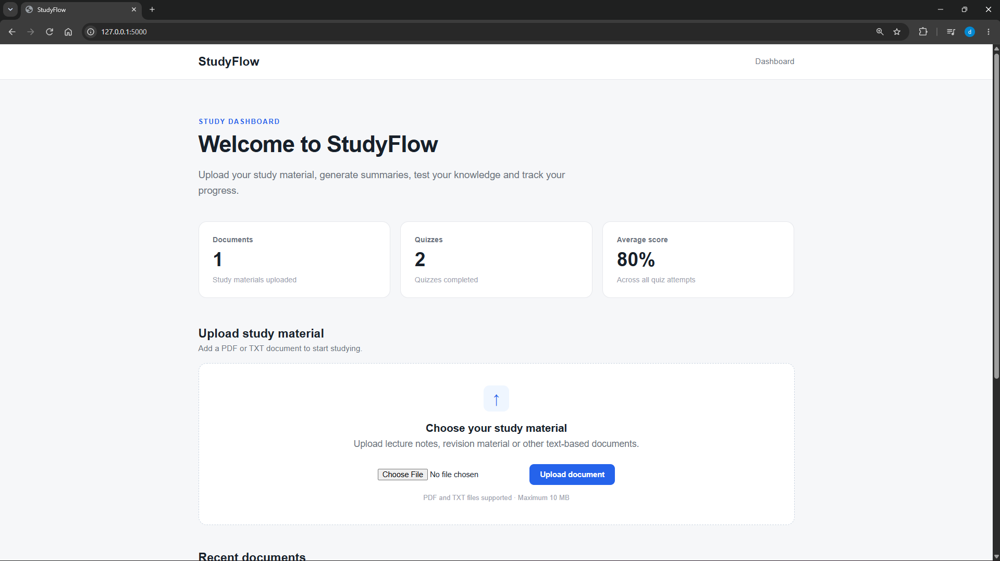
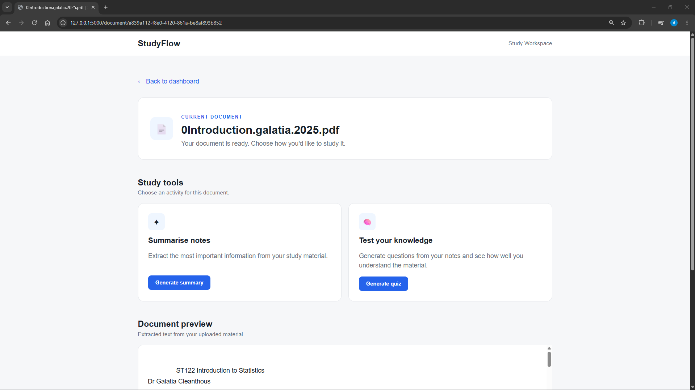
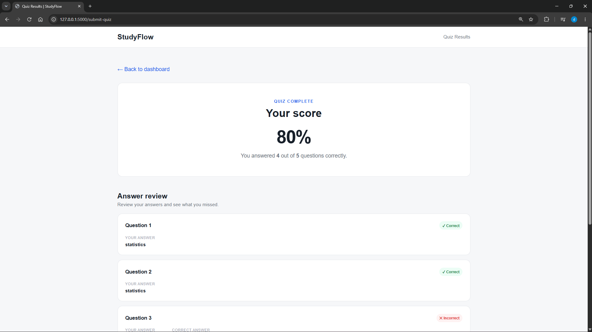

# StudyFlow

StudyFlow is a web-based study assistant built with Python and Flask. It allows students to upload study material, generate summaries, create quizzes from their notes, and track their quiz performance through a simple dashboard.

The project was built to explore backend web development, document processing, database management, session handling, and text-processing algorithms.

## Features

- Upload PDF and TXT study material
- Extract text from uploaded documents
- Generate extractive summaries from notes
- Automatically generate fill-in-the-blank quizzes
- Submit answers and receive quiz scores
- Review correct and incorrect answers
- Track previous quiz results
- View average quiz performance
- Reopen previously uploaded documents
- Delete documents and associated quiz data
- Handle invalid and corrupted documents
- Responsive user interface
- Automated tests for core application functionality

## Screenshots

### Dashboard

The StudyFlow dashboard provides an overview of uploaded documents, completed quizzes and average quiz performance.



### Study Workspace

Uploaded documents can be previewed and used to generate summaries or quizzes.



### Quiz Results

Quiz attempts are scored automatically, with feedback showing correct and incorrect answers.


## How It Works

### Document Processing

Uploaded PDF documents are processed using `pypdf`, while TXT documents are read directly using Python.

Files are assigned unique identifiers before being stored to prevent filename conflicts.

### Summarisation

StudyFlow uses a local extractive summarisation algorithm.

The application:

1. Splits the document into sentences.
2. Removes common stop words.
3. Calculates word frequencies.
4. Scores sentences based on important word frequency.
5. Selects the highest-scoring sentences.
6. Preserves their original document order.

This allows summaries to be generated locally without requiring an external AI API.

### Quiz Generation

The quiz generator analyses frequently occurring words within the study material and creates fill-in-the-blank questions from relevant sentences.

Correct answers are stored in the Flask session while the quiz is active rather than being exposed in the HTML form.

### Data Persistence

StudyFlow uses SQLite to store:

- Uploaded document metadata
- Quiz results
- Scores
- Completion timestamps

SQL queries including `JOIN`, `COUNT`, and `AVG` are used to generate document history, quiz history, and dashboard statistics.

## Technologies

- Python
- Flask
- SQLite
- HTML
- CSS
- Jinja2
- pypdf
- Git
- GitHub
- pytest

## Project Structure

```text
ai-study-assistant/
│
├── app/
│   ├── app.py
│   ├── database.py
│   ├── summariser.py
│   ├── quiz_generator.py
│   │
│   ├── static/
│   │   └── style.css
│   │
│   ├── templates/
│   │   ├── index.html
│   │   ├── workspace.html
│   │   ├── summary.html
│   │   ├── quiz.html
│   │   ├── quiz_results.html
│   │   └── error.html
│   │
│   └── uploads/
│
├── tests/
├── .gitignore
├── requirements.txt
└── README.md
```

## Installation

### 1. Clone the repository

```bash
git clone https://github.com/deogonci/ai-study-assistant.git
cd ai-study-assistant
```

### 2. Create a virtual environment

```bash
python -m venv venv
```

On Windows:

```bash
venv\Scripts\activate
```

On macOS/Linux:

```bash
source venv/bin/activate
```

### 3. Install dependencies

```bash
pip install -r requirements.txt
```

### 4. Configure the application

For development, StudyFlow can run using its fallback development secret.

For a production environment, set a secure `SECRET_KEY` environment variable.

### 5. Run StudyFlow

```bash
python app/app.py
```

Open the local address displayed by Flask in your browser.

## Running Tests

Run the automated test suite from the project root:

```bash
pytest -v
```

The test suite covers core summarisation, quiz generation and file-validation behaviour.

## Error Handling

StudyFlow validates uploaded documents and handles:

- Unsupported file types
- Corrupted documents
- Documents containing no extractable text
- Files larger than 10 MB
- Missing documents

Failed uploads are removed automatically rather than being retained by the application.

## What I Learned

Building StudyFlow gave me practical experience with:

- Building backend applications using Flask
- Designing routes and handling HTTP requests
- Processing uploaded files securely
- Working with PDF and text documents
- Using Flask sessions
- Designing and querying SQLite databases
- Creating relationships between application data
- Writing parameterised SQL queries
- Using SQL joins and aggregate functions
- Implementing text-processing algorithms
- Handling application errors
- Separating development and production configuration
- Building responsive interfaces
- Using Git and GitHub for version control

## Future Improvements

Potential improvements include:

- Document search
- Question answering based on uploaded notes
- Improved natural-language quiz generation
- Multiple quiz types
- User accounts and authentication
- PostgreSQL support
- Automated tests
- Cloud deployment

## Author

**Divine Odafen**

Computer Science student at Maynooth University.